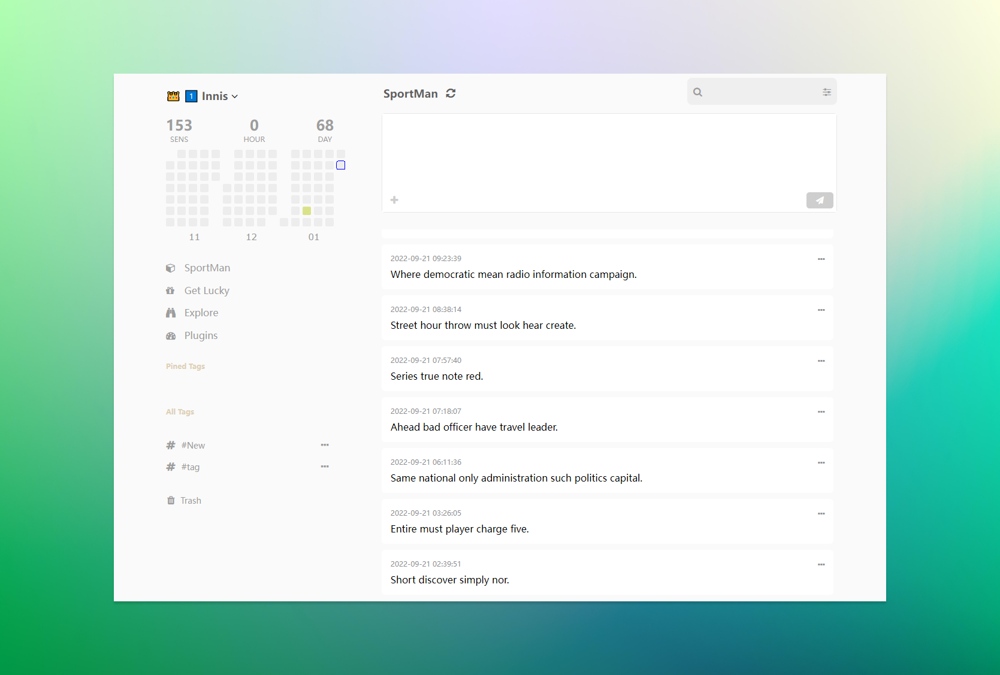
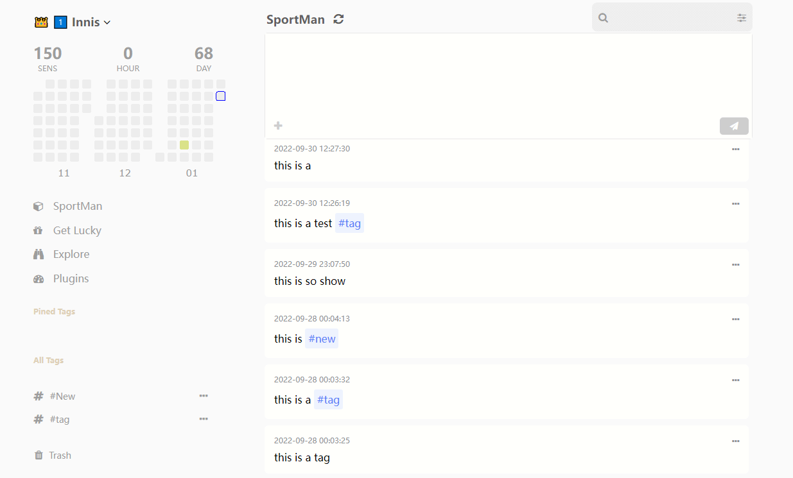
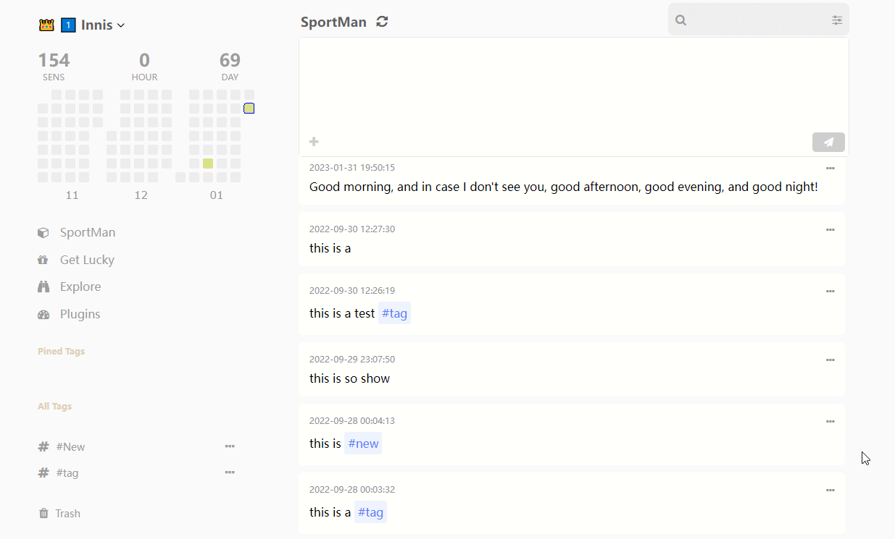
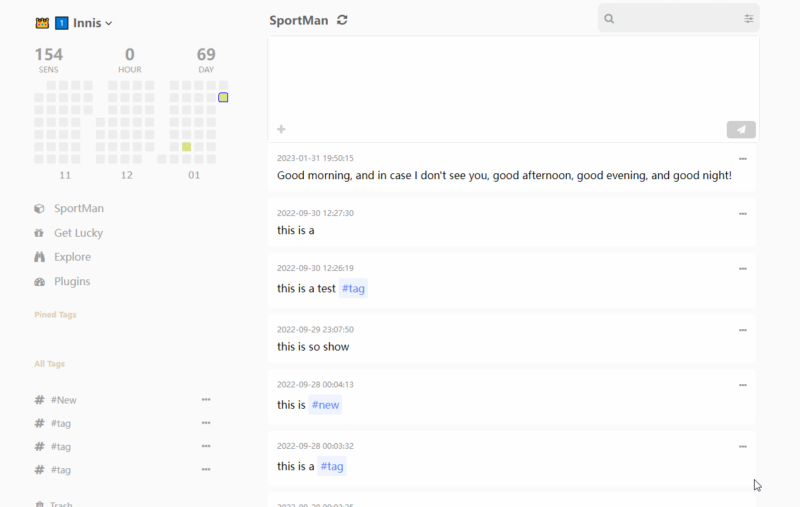
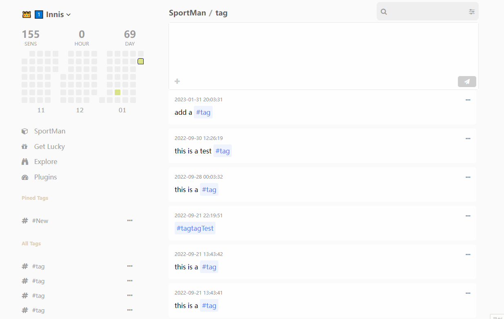

<a name="readme-top"></a>

# Sportman




## 💻 Prerequisites

Before you begin, make sure that you have met the following requirements:

* You have installed the latest version of Python, nodeJS
* You have installed MySQL service


## 🚀 Installing 

To install this project, follow these steps:

```bash
$ pip install -r requirements.txt
$ yarn
$ yarn dev
```

## ☕ Usecase

### 1. Add a sentence


### 2. Learn a word


### 3. Add a tag


### 4. Search


## 📫 Contributing

To contribute this project, follow these steps:

1.	Fork this repository.
2.	Crie um branch: `git checkout -b <some_branch>`
3.	Make your changes and confirm them: `git commit -m <message_commit>`
4.	Push to the original branch: `git push origin <peoject_name> / <local>`
5.	Create the pull request.

Alternatively, see the GitHub documentation on how to [create a pull request](https://help.github.com/en/github/collaborating-with-issues-and-pull-requests/creating-a-pull-request).


## 🤝 Collaborations

<a href="https://github.com/yuenci" target="_blank" >
  
</a>

Your Name - [@your_twitter](https://twitter.com/your_username) - email@example.com


## 😄 Be one of the contributors

Want to be part of this project? Click HERE and read how to contribute.

## 📝 License

This project is under license. See the [LICENSE](./LICENSE) file for more details.

<p >(<a href="#readme-top">⬆ Back to top</a>)</p>

